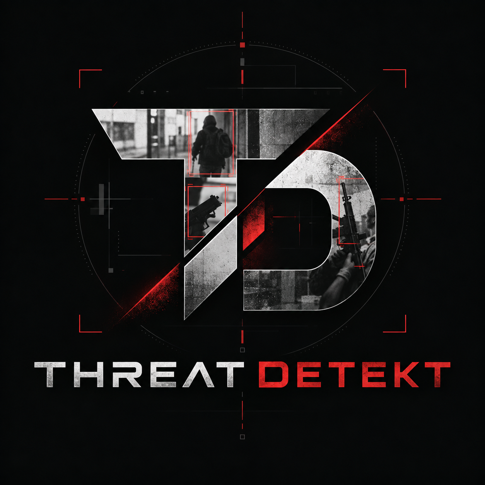

# Threat Detekt

Threat Detekt is a custom-trained computer vision and object detection platform designed for real-time security monitoring and early identification of potentially armed individuals. The system detects people and weapon classes including pistols, rifles, shotguns, and knives, with the goal of identifying situations where a person may be in possession of an object capable of causing serious bodily injury or death.

The project is built around low-latency inference, flexible deployment, and integration into larger security or monitoring systems. Threat Detekt can operate as a centralized inference service processing live or near-real-time imagery, or as an embedded application running directly on edge computing hardware such as the NVIDIA Jetson Orin NX.

## Overview

Threat Detekt provides an end-to-end foundation for training, deploying, and integrating a custom object detection model into real-world security applications.

The repository includes tooling and source code for:

* Training and evaluating the custom Threat Detekt object detection model.

* Detecting people, pistols, rifles, shotguns, and knives within image or video data.

* Running low-latency inference on NVIDIA Jetson edge computing platforms.

* Hosting the model as an inference service for applications that stream images or video frames for analysis.

* Producing structured detection results that can be consumed by alerting, monitoring, logging, or downstream event-processing systems.

Threat Detekt is intended to act as a detection and decision-support component within a broader security architecture rather than as a standalone security system.

## Capabilities

Threat Detekt currently supports detection of the following object classes:

* person

* pistol

* rifle

* shotgun

* knife

The system is designed around several core capabilities:
### Real-Time Object Detection
Processes image and video frames to identify people and supported weapon classes with configurable confidence thresholds.

### Person and Weapon Identification
Provides detection data that can be used to determine when a weapon is associated with or possessed by a detected person.

### Edge Inference
Supports deployment on NVIDIA Jetson hardware for local processing where bandwidth, latency, connectivity, or privacy requirements make centralized inference undesirable.

### Centralized Model Serving
Supports deployment as an inference service where remote applications can submit imagery for analysis.

### Hardware-Accelerated Inference
Can take advantage of NVIDIA GPU acceleration and optimized inference runtimes when deployed on supported hardware.

### Structured Detection Output
Detection results can be integrated with downstream systems for alert generation, event correlation, telemetry, video analytics, or security monitoring workflows.